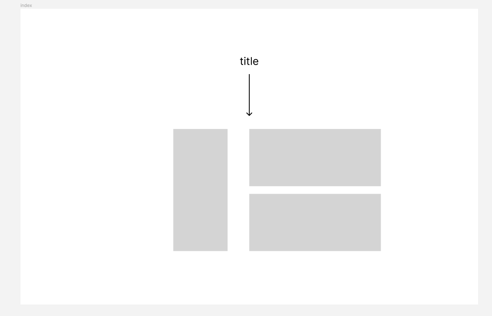
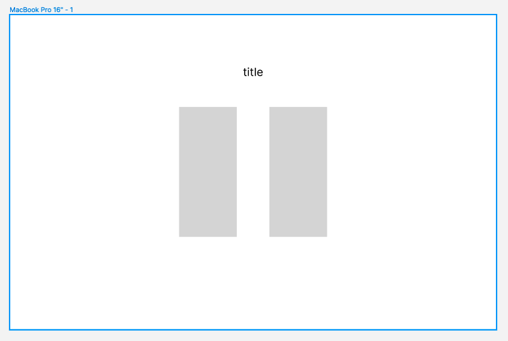
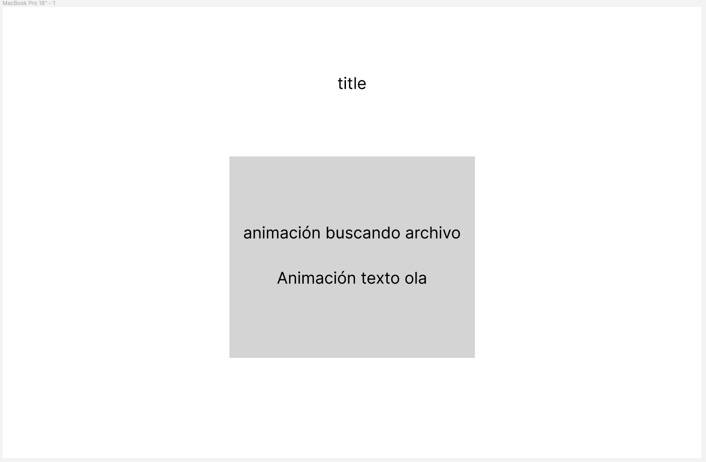
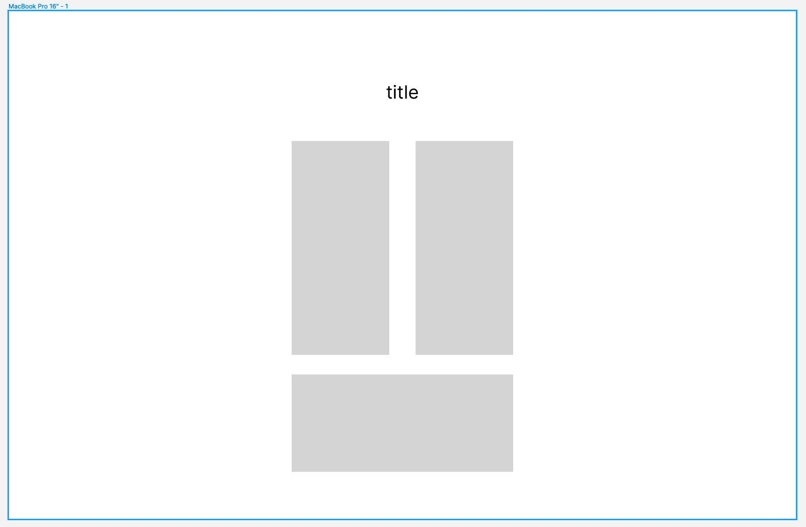

# Portfolio Alejandro García Álvarez

## Proceso de diseño

Lo primero que hice fue hacer unos pequeños bocetos muy simples de como quería que fuese la página. Tenía claro que quería cuatro páginas diferentes, una por apartado a las cuales se accediese desde un menú que estaría en la parte superior. La página principal y la que se muestra cuando se accede al url es la de descripción, cuyo boceto proncipal es el siguiente:

Esta página estaría tendría un título, una animación con el fin de que la gente haga scroll hacia abajo más facilmente si no conoce la página y tres tarjetas. En la primera tarjeta mi idea era poner una valoración, mediante un sistema de estrellas, de los principales conocimientos que he ido adquiriendo este curso. En la segunda de ellas pondría una pequeña descripción sobre mí, de quien soy y como llegué a estudiar esto. En la última tarjeta puse las motivaciones que tengo y lo que sería un poco mi meta a futuro.

La segunda página sería la de Formación y el boceto que hice en un principio es el siguiente:

En esta página quería mostrar principalmente dos cosas, las cuales son mi actual nivel de estudios y mi actual nivel de idiomas, por ello, pensé que quedaría bastante bien estructurado en dos tarjetas dividuendo la página en dos columnas. En la primera de ellas, la de la izquierda, puse mi nivel de estudios, y en la de la derecha, puse mi nivel de idiomas.

En cuanto a la tercera página, la de formación, tuve bastantes dudas sobre qué hacer. Al no tener todacía experiencia laboral pensé en no crearla, pero al final decidí hacerlo por si en un futuro quiero actualizarla, poder hacerlo más fácilmente. El boceto que desarrollé entonces es el siguiente:

Lo que decidí hacer es poner una animación, para hacer que se viese bien y no quedase muy soso este apartado. Pensé en poner una que no encontrase archivos con una frase debajo con un efecto como si estuviese cargando. Buscando en LottieFiles encontré una que coincidía bastante con lo que estaba buscando, así que la edité para que los colores fuesen acordes a los del resto de la página y la añadí. Para el texto, puse una frase y la animé dandole un delay diferente a cada letra para conseguir un efecto ola que se ejecuta permanentemente, como si se estuviesen buscando archivos.

La página que falta es la de proyectos personales. La idea principal era poner los dos proyectos más significativos que he realizado. También quería añadir un apartado desde el que acceder a mi perfil de GitHub para que la gente viese los demás proyectos que he realizado y que no he añadido a la página por temas de estética. El boceto es el siguiente:

El diseño es bastante parecido a la página principal, pero sin la animación de scroll y cambiando la disposición de las tarjetas. En las que están de forma vertical pondría los dos ejemplos, el del supermercado y el propio portfolio, explicando ambos brevemente.

Por último decidí añadir un footer en el cual hay una imagen de un sobre, la cual te redirige a el correo por si quieres contactar conmigo y el logo de GitHub por si le quieres echar un vistazo.

### Elección de color

Lo primero que hice cuando estaba desarrollando el menú fué elegir el color que iba a utilizar. Tras probar varios y ver como quedaban me decidí por el azul oscuro. En un principio sólo iba a utilizar este color para la página principal y utilizar otros para las demás, pero encontré una imagen con una tonalidad de colores exáctamente igual al que había utilizado en el menú, y al gustarme tanto la estética y como se uniformaba todo decidí dejarlo así para todas las páginas. la imagen es la siguiente:

En cuanto a las tarjetas de información en un principio iban a ser de un color azul, retocando la opacidad para que se integrase mejor con el fondo, pero eso lo hice únicamente con el header y el footer. A las tarjetas les dí un efecto de difuminado que a mi parecer queda espectacular.

En cuando al color de la fuente elegí el blanco ya que era el que mejor se integraba y se contrastaba con el azul.

### Responsive

Una vez terminada la página como estaba en los bocetos el siguiente paso era hacerla responsive. Para ello lo que hice fue que a partir de determinados píxeles de ancho las tarjetas en vez de agruparse como en los bocetos se agrupasen unas debajo de otras, para poder visualizar correctamente el contenido.

En cuanto al menú, como la hacerse más pequeña la pantalla decidí ocultar los diferentes botones y dejar un "burger menu" el cual se despliega al hacer click sobre él en vesiones móviles o al pasar el cursor por encima ordenadores.
